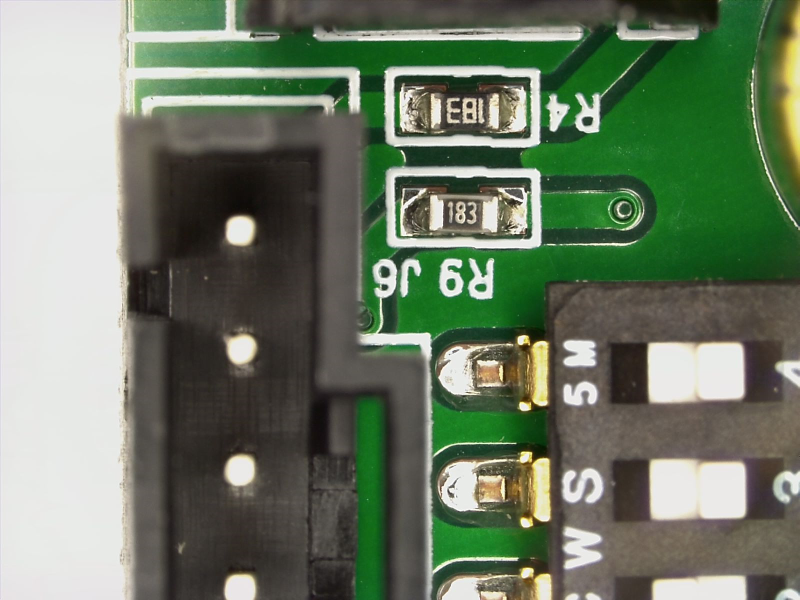

# PCB Components Detection Using Object Detection Techniques

## Motivation

Target detection of electronic components on PCB (Printed circuit board) based on vision is the core technology for 3C (Computer, Communication and Consumer Electronics) manufacturing companies to achieve quality control and intelligent assembly of robots. But the major problem is that their are lot of component in the PCB are available and detecting them is pretty much difficult task manually. At present their are very less, automated tools are available using which we can detect the micro-components inside the pcb and detecting them manually is a tough job.

Detecting the components will help us to achive following things:

* Count the number of the PCB (Printed Circuit Board) Components like Resistor, Capacitor, IC's, switches, paded_transistor and transistor using some object detection algorithms and then compare it with the count of the component which are present in the PCB. This help us to find weither the pcb is perfectly suitable for production or not.
* Oreintation Detection, as we known each and every component in the pcb board should be perfectly algined and should be in particular orientation.

## Evaluation 1 - Dataset Collection and Annotation

Collected the dataset which various components like:

1. Resistor
2. Capacitor
3. Switch
4. Connector
5. paded transistor
6. text(random electronic component names/code on board)

***Sample Image showing Capacitor, Switch and Connector.***
<p align="center">
  
</p>

The images are captured from DLSR, because as we know whenever we are performing classification+localization of the object we need to have a high resolution images most of the images are of 1600x1200 with .tif format.

Once the dataset is being collected, now we need to annotate the images depending upon which algorithm we are using, their are many object detection algorithm which are available in the market like:

1. Faster RCNN
2. Fast RCNN
3. SSD
4. MobileNet
5. YoloV5(You Look only Once)

The above algorithm require a particular format of Annoation, in which the some common annotations are,

1. COCO (The object coordinates are present in the JSON format)
2. Pasacal VOC (The object coordinates are present in the 
3. Yolo Annotations (The object coordinates areb prent in the text file format)

So, for annotating the objects, we have experimented over few of the tools like labelimg, VGG-Annotator but we have founded Label Studio the best one.

Below are some images from label studio:

<p align="center">
  
</p>

After labelling the images can get the annotatios in any format like text, pascal voc, coco json.'

Yolo annotation look like below one

```
3 0.5766666666666667 0.1758436944937833 0.19333333333333333 0.11012433392539965
3 0.5826666666666667 0.3481349911190053 0.18666666666666668 0.10301953818827708
1 0.3040000000000003 0.5985790408525754 0.2960000000000003 0.7957371225577267
4 0.8420000000000001 0.7362344582593251 0.3133333333333333 0.5275310834813499
```

In a similar way we can annotate the multiple images and then we can move towards the step of model training.
